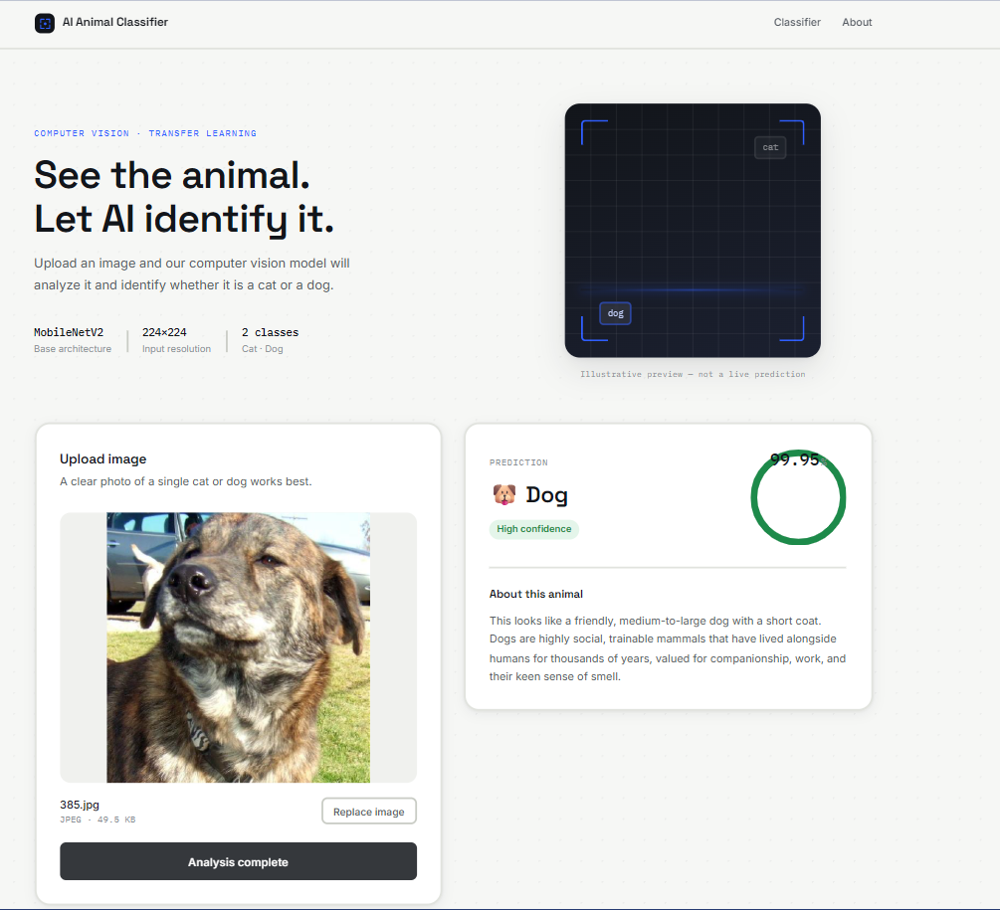

# 🐾 AI Animal Classifier

> A full-stack Computer Vision application for intelligent **Cat vs Dog image classification**, combining deep learning, a Flask REST API, a React frontend, and Gemini-powered animal descriptions.

<p align="center">
  <b>Computer Vision · Deep Learning · Transfer Learning · Flask · React · Gemini AI</b>
</p>

<p align="center">
  
  
  
  
  
  
  
</p>

---

## 📸 Demo

The application provides an interactive interface where users can upload an animal image and receive:

- 🐱 **Predicted animal class**
- 📊 **Confidence score**
- 🤖 **AI-generated animal description**

### 🐱 Cat Prediction

<p align="center">
  
</p>

### 🐶 Dog Prediction

<p align="center">
  
</p>

---

## 📌 Overview

**AI Animal Classifier** is an end-to-end Computer Vision application that classifies animal images into two categories:

- 🐱 **Cat**
- 🐶 **Dog**

The project demonstrates the complete lifecycle of a Computer Vision application — from image preprocessing and model inference to backend API development, frontend integration, and Generative AI.

The complete pipeline is:

```text
User Image
    │
    ▼
React Frontend
(Image Upload / UI)
    │
    │ HTTP POST
    ▼
Flask REST API
    │
    ▼
Image Preprocessing
(RGB → Resize → Normalize)
    │
    ▼
Deep Learning Model
(MobileNetV2)
    │
    ▼
Prediction + Confidence
    │
    ▼
Gemini AI
(Animal Description)
    │
    ▼
React Results Interface
