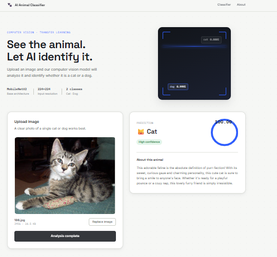

# 🐾 AI Animal Classifier

> A full-stack Computer Vision application for intelligent **Cat vs Dog image classification**, combining deep learning, a Flask REST API, a React frontend, and Gemini-powered animal descriptions.

<p align="center">
  <b>Computer Vision · Deep Learning · Transfer Learning · Flask · React · Gemini AI</b>
</p>

<p align="center">


</p>

---

## 📸 Demo

The application provides an interactive interface where users can upload an animal image and receive a classification, confidence score, and AI-generated description.

### 🐱 Cat Prediction

<p align="center">
  
</p>

### 🐶 Dog Prediction

<p align="center">
  
</p>

---

## 📌 Overview

**AI Animal Classifier** is an end-to-end Computer Vision application that classifies animal images into two categories:

- 🐱 **Cat**
- 🐶 **Dog**

The project demonstrates the complete lifecycle of a Computer Vision application — from image preprocessing and model inference to backend API development, frontend integration, and Generative AI.

The complete pipeline is:

```text
User Image
    │
    ▼
React Frontend
(Image Upload / UI)
    │
    │ HTTP POST
    ▼
Flask REST API
    │
    ▼
Image Preprocessing
(RGB → Resize → Normalize)
    │
    ▼
Deep Learning Model
(MobileNetV2)
    │
    ▼
Prediction + Confidence
    │
    ▼
Gemini AI
(Animal Description)
    │
    ▼
React Results Interface
```

---

## ✨ Key Features

### 🖼️ Image Classification

Upload an image of a cat or dog and receive a prediction from the trained Computer Vision model.

### 📊 Confidence Score

The application displays the model's confidence score visually through an interactive confidence ring.

### 🤖 AI-Generated Description

Gemini can generate a short natural-language description of the detected animal.

### ⚛️ Interactive React Interface

The frontend supports:

- Drag-and-drop image upload
- Image preview
- File validation
- Loading states
- Analysis animation
- Prediction results
- Confidence visualization
- Error handling
- Image replacement
- Reset functionality

### 🐍 Flask REST API

The backend exposes an API endpoint for image classification:

```text
POST /api/classify
```

Example response:

```json
{
  "label": "cat",
  "confidence": 0.9999997615814209,
  "description": "AI-generated animal description"
}
```

---

## 🧠 Machine Learning

The classification system uses deep learning and transfer learning, with **MobileNetV2** serving as the pretrained visual feature extraction backbone and a custom classification head for the Cat/Dog classification task.

### Why Transfer Learning?

Training a deep neural network entirely from scratch requires a large dataset and significant computational resources.

Transfer learning makes it possible to start from a model that has already learned general visual representations and adapt those learned features to a specific classification problem.

The conceptual architecture is:

```text
Pretrained MobileNetV2
        │
        ▼
Visual Feature Extraction
        │
        ▼
Custom Classification Head
        │
        ▼
     Cat / Dog
```

---

## 🔬 Computer Vision Pipeline

The `cv/` directory contains the main Computer Vision and machine learning workflow.

```text
Dataset
   │
   ▼
Image Exploration
   │
   ▼
Dataset Preparation
   │
   ▼
Preprocessing
   ├── Convert to RGB
   ├── Resize to 224 × 224
   └── Normalize pixel values
   │
   ▼
Training / Validation
   │
   ▼
Deep Learning Model
   │
   ▼
Model Evaluation
   │
   ▼
Saved Keras Model
   │
   ▼
Inference / Prediction
```

### 🖼️ Image Preprocessing

Before an image is passed to the model, it follows a consistent preprocessing pipeline.

**1. RGB Conversion**

Images are converted to RGB format to ensure a consistent three-channel input.

**2. Resizing**

Every image is resized to:

```text
224 × 224 × 3
```

**3. Normalization**

Pixel values are normalized to the range:

```text
[0, 1]
```

This provides a consistent numerical representation for the neural network.

---

## 🧩 Model Architecture

The project uses a transfer-learning-based image classification approach centered around MobileNetV2.

```text
Input Image
224 × 224 × 3
        │
        ▼
    MobileNetV2
        │
        ▼
Visual Feature Extraction
        │
        ▼
Classification Head
        │
        ▼
   2-Class Output
      ┌───┴───┐
      ▼       ▼
    Cat      Dog
```

The model produces probabilities for the available classes. The class with the highest probability is selected as the predicted label.

---

## 📈 Prediction

For an input image, the model produces probabilities representing how strongly it supports each class.

Example:

| Class | Probability |
|---|---:|
| 🐱 Cat | 99.99% |
| 🐶 Dog | 0.01% |

The backend returns both the **predicted label** and **confidence score**, allowing the frontend to communicate both the model's prediction and its confidence.

---

## 🐍 Backend

The backend is implemented using **Flask**.

Its main responsibility is to connect the React interface with the trained machine learning model.

```text
Receive Image
     ↓
Validate Upload
     ↓
Preprocess Image
     ↓
Run Model
     ↓
Generate Prediction
     ↓
Calculate Confidence
     ↓
Generate Description
     ↓
Return JSON Response
```

### API Endpoint

```text
POST /api/classify
```

Example request:

```bash
curl -X POST http://127.0.0.1:5000/api/classify \
  -F "image=@path/to/image.jpg"
```

Example response:

```json
{
  "label": "cat",
  "confidence": 0.9999997615814209,
  "description": "AI-generated animal description"
}
```

---

## ⚛️ Frontend

The frontend is built using:

- React
- Vite
- JavaScript
- CSS

The interface is organized into reusable components.

```text
src/
│
├── App.jsx
│
├── components/
│   ├── Header.jsx
│   ├── Hero.jsx
│   ├── ClassifierCard.jsx
│   ├── ConfidenceRing.jsx
│   └── ResultsPanel.jsx
│
├── lib/
│   └── classify.js
│
└── assets/
```

### `ClassifierCard`

Responsible for:

- Selecting an image
- Drag-and-drop upload
- File validation
- Image preview
- Starting analysis
- Replacing the selected image

### `ResultsPanel`

Responsible for:

- Prediction result
- Confidence
- Animal description
- Loading state
- Error state
- Empty state

### `ConfidenceRing`

Provides a visual representation of the model's confidence.

---

## 🤖 Gemini Integration

Gemini is used to generate a human-readable description of the classified animal.

The Computer Vision model handles classification:

```text
Image → Cat / Dog + Confidence
```

Gemini handles natural-language generation:

```text
Classification Result → Animal Description
```

This creates a separation between:

**Computer Vision**

and

**Generative AI**

The Gemini API key is accessed through an environment variable:

```python
os.getenv("GEMINI_API_KEY")
```

The real API key is never stored in the repository.

---

## 🔐 Security

API credentials should never be committed to GitHub.

The project uses an environment variable:

```text
GEMINI_API_KEY=your_api_key_here
```

The real `.env` file should be excluded through `.gitignore`.

A safe `.env.example` file can be provided as a template.

**Never replace the placeholder in `.env.example` with a real API key before committing it.**

---

## 📁 Project Structure

```text
AI-Animal-Classifier/
│
├── backend/
│   ├── app.py
│   └── requirements.txt
│
├── cv/
│   ├── train.py
│   ├── predict.py
│   ├── preprocess.py
│   ├── explore_image.py
│   ├── extract_subset.py
│   └── check_zip.py
│
├── frontend/
│   ├── public/
│   ├── src/
│   │   ├── assets/
│   │   ├── components/
│   │   ├── lib/
│   │   ├── App.jsx
│   │   ├── App.css
│   │   ├── index.css
│   │   └── main.jsx
│   ├── package.json
│   ├── package-lock.json
│   └── vite.config.js
│
├── model/
│   └── animal_classifier.keras
│
├── screenshots/
│   ├── cat-demo.png
│   └── dog-demo.png
│
├── .gitignore
├── LICENSE
└── README.md
```

---

## 🛠️ Technology Stack

| Layer | Technology |
|---|---|
| Programming Language | Python |
| Machine Learning | TensorFlow / Keras |
| Computer Vision | PIL / NumPy |
| Deep Learning Architecture | MobileNetV2 |
| Backend | Flask |
| API | REST |
| Frontend | React |
| Build Tool | Vite |
| Frontend Language | JavaScript |
| Generative AI | Gemini |
| Version Control | Git |
| Repository | GitHub |

---

## 🚀 Installation & Setup

### 1. Clone the Repository

```bash
git clone https://github.com/Mariam-musa/AI-Animal-Classifier.git
cd AI-Animal-Classifier
```

### 2. Backend Setup

```bash
cd backend
```

Create a virtual environment:

```bash
python -m venv .venv
```

Activate it on Windows:

```bash
.venv\Scripts\Activate.ps1
```

Install dependencies:

```bash
pip install -r requirements.txt
```

Run the Flask server:

```bash
python app.py
```

The backend will run at:

```text
http://127.0.0.1:5000
```

### 3. Frontend Setup

Open a second terminal:

```bash
cd frontend
npm install
npm run dev
```

Open the local URL provided by Vite, normally:

```text
http://localhost:5173
```

---

## 🔑 Environment Variables

If Gemini descriptions are enabled, create a `.env` file and configure:

```text
GEMINI_API_KEY=your_api_key_here
```

Do not commit the real API key.

---

## 🧪 Testing the Backend

The API can be tested independently from the frontend:

```bash
curl -X POST http://127.0.0.1:5000/api/classify \
  -F "image=@path/to/image.jpg"
```

A successful request returns:

- `label`
- `confidence`
- `description`

This allows the backend and machine learning pipeline to be tested independently from the React interface.

---

## 🔄 End-to-End Workflow

| Step | Description |
|---|---|
| 1. Upload | The user selects or drops an image into the React application. |
| 2. Preview | The frontend creates a local preview of the image. |
| 3. Analyze | The user starts the classification process. |
| 4. API Request | React sends the image to `POST /api/classify`. |
| 5. Preprocessing | The backend applies the required image preprocessing. |
| 6. Inference | The trained model processes the image. |
| 7. Classification | The model predicts Cat or Dog with a confidence score. |
| 8. Description | Gemini generates a short natural-language description. |
| 9. Display | The React interface displays the final result. |

---

## 🎯 Project Goals

This project was developed to explore the practical implementation of a complete AI application rather than focusing only on model training.

The main learning goals include:

- Understanding Computer Vision fundamentals
- Working with image datasets
- Building image preprocessing pipelines
- Understanding CNN-based image classification
- Applying transfer learning with MobileNetV2
- Training and saving Keras models
- Performing model inference
- Building REST APIs with Flask
- Connecting machine learning models to web applications
- Building reusable React components
- Handling asynchronous frontend requests
- Integrating Generative AI
- Managing environment variables and API credentials
- Using Git and GitHub for version control

---

## 📚 What This Project Demonstrates

```text
                 AI APPLICATION
                       │
          ┌────────────┴────────────┐
          │                         │
  Computer Vision            Web Application
          │                         │
          ▼                         ▼
 Image Processing             React Frontend
          │                         │
          ▼                         ▼
 Deep Learning                  Flask API
          │                         │
          └────────────┬────────────┘
                       │
                       ▼
                 AI Integration
                       │
                       ▼
                  Gemini AI
```

The result is a complete pipeline:

```text
Raw Image
    ↓
Image Preprocessing
    ↓
Deep Learning Inference
    ↓
Prediction + Confidence
    ↓
Flask REST API
    ↓
React Interface
    ↓
Gemini-generated Description
```

---

## 🧠 Future Improvements

The current system focuses on Cat/Dog classification, but the architecture can be extended with:

- **More animal classes** — expand beyond Cat/Dog
- **Larger datasets** — improve diversity and generalization
- **Data augmentation** — rotation, flipping, zoom, translation, brightness variation
- **Fine-tuning** — fine-tune selected MobileNetV2 layers
- **Model evaluation** — accuracy, precision, recall, F1-score, confusion matrix
- **Deployment** — make the application accessible remotely
- **Prediction history** — store previous classifications
- **Multiple image analysis**
- **Improved mobile responsiveness**
- **Accessibility improvements**

---

## ⚠️ Important Notes

- Never commit API keys, passwords, tokens, or other credentials.
- The trained model is stored under `model/animal_classifier.keras`.
- `node_modules` is intentionally excluded from the repository.
- Frontend dependencies can be installed using `npm install`.
- Python dependencies can be installed using `pip install -r requirements.txt`.
- The `.env` file should be excluded from Git.

---

## 👩‍💻 Author

### Mariam Mousa

**Computer Science / Artificial Intelligence Student**

This project was developed as a hands-on exploration of Computer Vision, Deep Learning, backend development, frontend development, and Generative AI integration.

---

## ⭐ Project Highlights

✔ Computer Vision  
✔ Deep Learning  
✔ Transfer Learning  
✔ MobileNetV2  
✔ Image Preprocessing  
✔ Model Training  
✔ Model Inference  
✔ Confidence Scoring  
✔ Flask REST API  
✔ React Frontend  
✔ Vite  
✔ Gemini AI Integration  
✔ Environment Variable Security  
✔ Git / GitHub  

---

## 📄 License

This project is licensed under the MIT License.

<p align="center">

🐱 Teach machines to see. 🐶  
<br>
🤖 Connect intelligence to applications.

<br><br>

<b>AI Animal Classifier</b>

</p>
